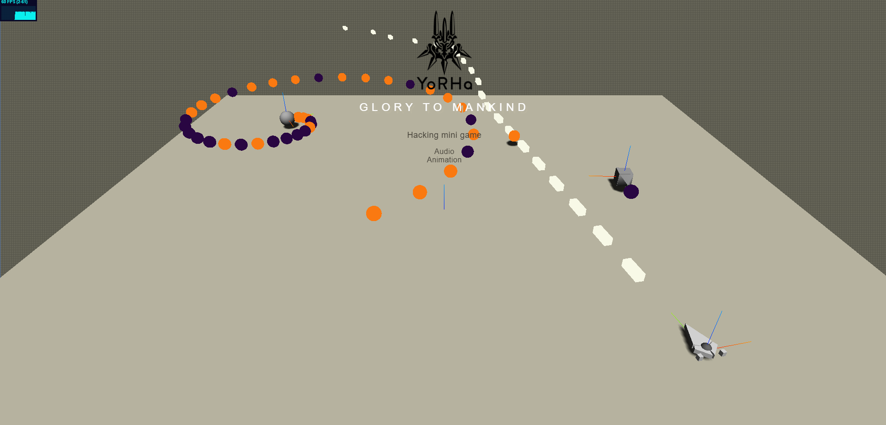

# YorHa.jS


Small conceptual game & game engine using React/Redux/Three.js/Cannon.js and inspired by Unity.

Implements a simple replica of the NieR: Automata hacking mini-game.

### Running the project

```
npm install
npm run start
```

### Building

```
npm run build
```

